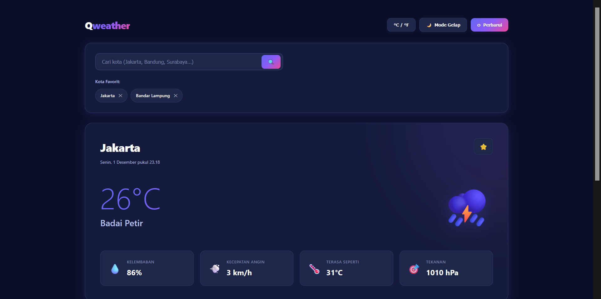
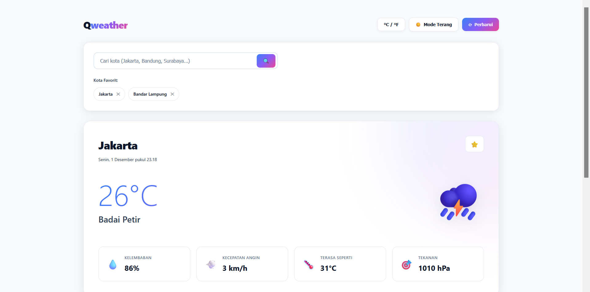

  

<h1 align="center">🌤️✨ Qweather</h1>

<i>Dashboard Cuaca Modern & Interaktif untuk Kota-Kota di Indonesia</i>

  
   
  

---

### 🚀 *Clean • Responsive • Real-time*  

---

## 🎯 **Apa itu Qweather?**

Qweather adalah aplikasi web sederhana namun powerful untuk menampilkan cuaca **real-time** di seluruh kota di Indonesia.  

Qweather juga memanfaatkan **Open-Meteo API**, sehingga data cuaca akurat tanpa perlu API key tambahan.

---

## 🌈 **Fitur Unggulan**

✨ *Smooth, minimalistic, and interactive UI*  
⚡ Real-time weather update  
🔍 Pencarian kota Indonesia super akurat (menggunakan geocoding)  
🌡️ Suhu 
💨 Kecepatan angin  
💧 Kelembaban  
🎯 Tekanan udara  
⭐ Favorit kota (tersimpan di LocalStorage)  
🌓 Mode Gelap & Terang (dengan transisi lembut)  
🔁 Refresh otomatis  
📱 Full responsive design  

---

## 🛠️ **Teknologi yang Digunakan**

| Teknologi | Fungsi |
|----------|--------|
| **HTML5** | Struktur halaman |
| **CSS3** | UI/UX, animasi, responsive design |
| **JavaScript (Vanilla)** | Logic, fetch API, DOM interaction |
| **Open-Meteo Weather API** | Data cuaca real-time |
| **Open-Meteo Geocoding API** | Pencarian kota Indonesia |

---

## 💛 **Kredit**
Dibuat oleh **Rendy Antono** untuk memenuhi tugas akhir praktikum pemrograman web judul 6.

